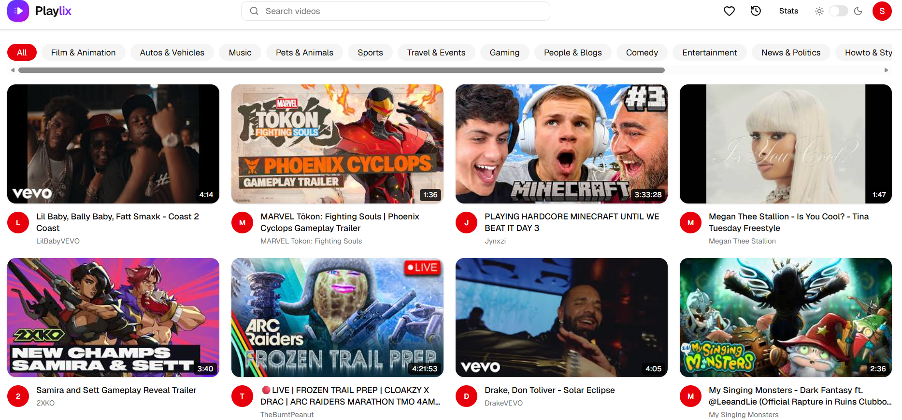
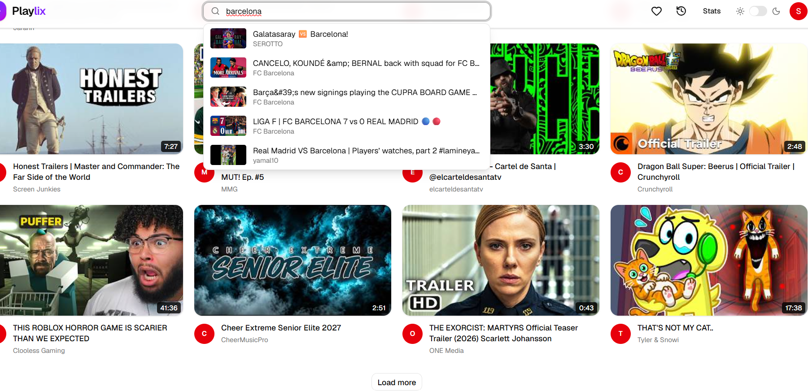
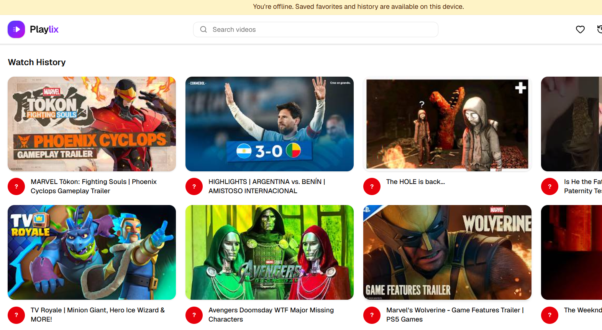

# Playlix

Playlix is a video discovery and watch-list app for browsing and searching YouTube in one place. It helps users find videos, watch them, and keep favorites, viewing history, and comments tied to their account.

## Screenshots

**Homepage:** browse videos by category.

**Search suggestions:** matching videos appear while typing.

**Offline history:** previously saved watch history remains available offline.

## Features

- Browse popular videos by category and search with live video suggestions.
- Watch videos in the YouTube player and explore related videos.
- Create an account to save favorites, view watch history, and post or delete rated comments.
- Use light, dark, or system themes; access the app shell and saved list snapshots offline.
- View aggregate API cache and quota statistics.

## How It Works

The Next.js app sends API requests through a same-origin route to the Express backend. The backend retrieves video data from the YouTube Data API and caches public responses in Redis. User accounts and saved content are stored in MongoDB; signed-in requests use an HTTP-only JWT cookie.

## Tech Stack

- **Frontend:** Next.js, React, TypeScript, Tailwind CSS, TanStack Query
- **Backend:** Node.js, Express, TypeScript
- **Data:** MongoDB with Mongoose, Redis
- **Integrations:** YouTube Data API v3, JWT authentication, Zod validation

## Challenges & Solutions

- **YouTube API quota and availability:** Cache normalized results, coalesce matching in-flight requests within each server process, and retain stale cache entries for fallback.
- **Browser authentication across the app and API:** Route browser calls through a same-origin Next.js rewrite and use an HTTP-only cookie for the session.
- **Useful offline access:** Cache the app shell and keep bounded IndexedDB snapshots of favorites and history; video playback and API actions still require a connection.

## Limitations

- Video playback and API-backed actions require an internet connection.
- Recommendations are based on popular videos in a category, not personalized viewing history.
- Request coalescing and rate limits use in-memory stores and are not shared across backend instances.

## Setup

### Prerequisites

Node.js 20.9 or newer, npm, MongoDB, Redis, and a YouTube Data API v3 key.

### Install and configure

From the repository root, install dependencies in each workspace and create the local environment files:

~~~sh
cd server
npm install
cp .env.example .env
~~~

Set `MONGO_URI`, `REDIS_URL`, `JWT_SECRET`, and `YOUTUBE_API_KEY` in `server/.env`. `PORT`, `CLIENT_URL`, `NODE_ENV`, and `JWT_EXPIRES_IN` are optional; the server defaults to port `5000` and the client origin `http://localhost:3000`.

In a second terminal:

~~~sh
cd client
npm install
cp .env.example .env.local
~~~

Set `API_SERVER_URL=http://localhost:5000` in `client/.env.local` for local development.

### Run

Start each workspace in a separate terminal:

~~~sh
# In server/
npm run dev
~~~

~~~sh
# In client/
npm run dev
~~~

Open <http://localhost:3000>.
